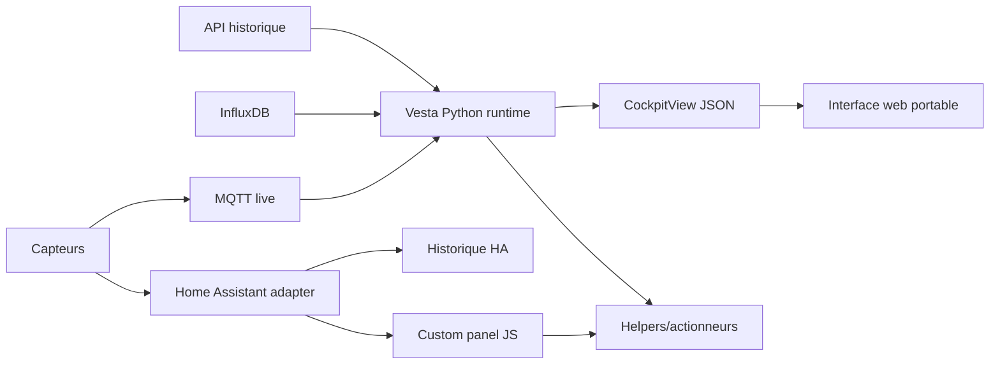
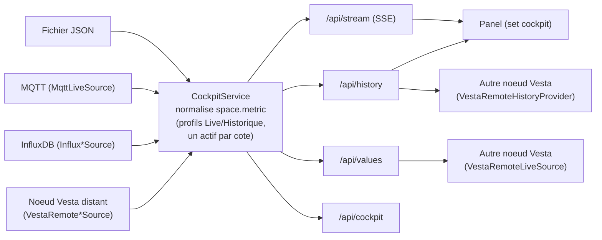

# Architecture Vesta Bioclimatic

## Objectif

Vesta doit garder le meme langage visuel et scientifique dans deux environnements :

- mode integre : Home Assistant fournit le live, l'historique court et les commandes ;
- mode portable : un serveur Python lit MQTT/API/InfluxDB et expose une vue normalisee.

## Vue d'ensemble



## JavaScript

Le panel JS est une application frontend autonome dans Home Assistant. Ses responsabilites :

1. lire les etats live ;
2. demander les historiques HA utiles ;
3. dessiner le diagramme psychrometrique ;
4. afficher points, traces, zones et scores ;
5. envoyer des intentions de commande ;
6. suivre la synchronisation entre consigne demandee et retour reel.

Il ne doit pas devenir le moteur scientifique principal a long terme. Les calculs critiques doivent progressivement migrer vers Python/API pour eviter deux sources de verite.

## Python

Le runtime Python est la source portable :

1. lire une configuration YAML ;
2. normaliser les mesures en `<space>.<metric>` ;
3. calculer les grandeurs psychrometriques ;
4. evaluer les strategies ;
5. produire `CockpitView`, un objet JSON-friendly ;
6. fournir plus tard une API HTTP et un connecteur MQTT.

## Contrat commun

Les deux mondes doivent converger vers la meme structure :

```json
{
  "timestamp": "2026-06-13T10:00:00Z",
  "pressure_hpa": 1013.2,
  "points": [
    {
      "key": "living",
      "label": "Living",
      "kind": "interior",
      "group": "rdc",
      "temp_c": 23.1,
      "rh_pct": 52,
      "humidity_ratio_g_kg": 9.1,
      "score": 82
    }
  ],
  "actuators": [
    {
      "key": "living_ceiling_fan",
      "kind": "ceiling_fan",
      "space": "living",
      "command": 3,
      "actual": 3,
      "synchronized": true
    }
  ]
}
```

## Regle de separation

- Les secrets restent cote serveur.
- Les entity_id Home Assistant restent dans l'adapter HA.
- Les pieces, etages/modules, volumes et actionneurs sont decrits en YAML.
- L'interface affiche des labels generiques et portables.

## Hub de connectivite (implemente)

Le mode portable est servi par un hub unique (`src/vesta_bioclimatic/server.py`,
`CockpitService`) : une boucle de fond tire les valeurs d'une `LiveSource`, les
enregistre dans un `HistoryProvider`, recompose le `CockpitView` et le pousse aux
abonnes SSE. Toute terminaison se reduit a ces deux abstractions
(`src/vesta_bioclimatic/sources.py`), donc ajouter un backend = ecrire un
adaptateur, sans toucher au panel.



Adaptateurs : `LiveSource` = `FileLiveSource` | `InfluxLiveSource` |
`MqttLiveSource` | `HistoryBackedLiveSource` | `VestaRemoteLiveSource` ;
`HistoryProvider` = `MemoryHistoryProvider` (sans dependance) |
`InfluxHistoryProvider` | `FileHistoryProvider` | `VestaRemoteHistoryProvider`.
Routes : `/api/cockpit`, `/api/stream` (SSE), `/api/history`, `/api/values`,
`/api/health`, `/api/connectivity`, `/api/mapping`, `/api/remote-mapping`.

**Federation** : `VestaRemoteLiveSource`/`VestaRemoteHistoryProvider` consomment
les series deja normalisees (`<space>.<metric>`) d'un autre noeud Vesta via
`GET /api/values`/`GET /api/history` — sans remapping. Cote panel, l'onglet
Live affiche l'URL `/api/stream` de ce hub et l'onglet Historique l'URL
`/api/history`, a renseigner dans un autre hub comme « Systeme Vesta distant ».

**Profils** : chaque cote (Live/Historique) garde une liste de profils nommes
persistants (`conn_state`), un seul actif a la fois ; activer un profil
permute a chaud (`CockpitService.reconfigure`). La pastille d'etat est orange
("portable", fichier/memoire uniquement), verte ("connecte", source live/
historique distante, MQTT ou InfluxDB active) ou rouge (`/api/health` en
erreur).

Cote panel, `set cockpit(view)` est la pendante portable de `set hass(...)` : le
meme composant, deux transports, un seul contrat `CockpitView` + series.
