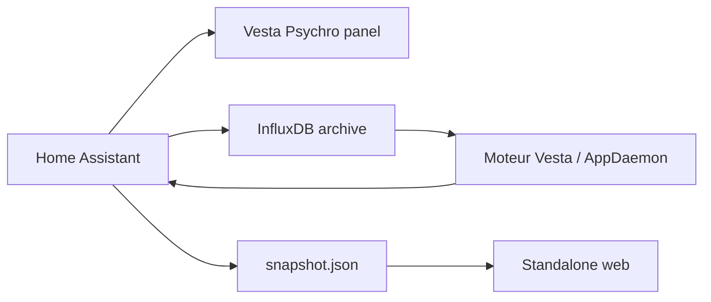

# Vesta Psychro - Integration InfluxDB

## Objectif

Home Assistant reste le mode autonome par defaut : le panel lit `hass.states`, les registres de pieces/etages et l'historique HA. InfluxDB devient utile pour :

- historiser longtemps les trajectoires psychrometriques ;
- alimenter une version standalone web sans token Home Assistant ;
- consolider des donnees de plusieurs maisons ;
- tracer les decisions de controle, les consignes et les retours utilisateur.

## Principe important

Un navigateur expose ne doit jamais contenir de token InfluxDB. La version web externe doit lire un `snapshot.json` ou appeler un proxy serveur. Le token InfluxDB reste cote serveur : Home Assistant, AppDaemon, un add-on, une fonction backend ou un reverse proxy applicatif.

Le contrat portable cible est detaille dans `docs/data-sources.md` : MQTT pour le live, API historique pour les series et InfluxDB uniquement derriere le backend.

## Mode Home Assistant

Dans Home Assistant, Vesta Psychro peut fonctionner sans InfluxDB :

- pieces et etages : `area_registry` et `floor_registry` ;
- valeurs instantanees : `hass.states` ;
- historiques courts : WebSocket HA `history/history_during_period` ;
- commandes : helpers `input_number`, scripts et services HA.

InfluxDB est alors une couche d'archive et d'analyse, pas une dependance critique.

## Mode Standalone

Hors Home Assistant, il faut fournir au moins un modele de donnees :

- une liste de pieces ;
- une temperature et une humidite relative par piece ;
- une pression atmospherique ou une valeur de reference ;
- un horodatage ;
- optionnellement : CO2, COV, bruit, luminosite, volume, etage, type de piece.

Le format recommande pour l'application web exposee est un `snapshot.json` genere cote serveur.

## Structure InfluxDB recommandee

Le point essentiel est de taguer les mesures avec la piece, l'etage et le type de grandeur. Sans tags de contexte, Vesta doit deviner les capteurs.

### Option A : measurement unique

Measurement : `vesta_climate`

Tags recommandes :

- `home`: identifiant du logement ;
- `room`: identifiant stable, ex. `living`, `chambre`, `salle_de_bain` ;
- `room_name`: nom lisible ;
- `floor`: `RDC`, `1`, `2`, `Exterieur` ;
- `zone`: `interior` ou `outdoor` ;
- `source`: `home_assistant`, `standalone`, `manual`, `computed` ;
- `sensor`: identifiant capteur ou entite HA ;
- `metric`: `temperature`, `relative_humidity`, `mixing_ratio`, `co2`, `voc`, `noise`, `illuminance`, `pressure`.

Fields :

- `value`: nombre ;
- `unit`: optionnel si l'unite est implicite par `metric`.

Exemple line protocol :

```text
vesta_climate,home=vesta,room=chambre,room_name=Chambre,floor=1,zone=interior,source=home_assistant,sensor=sensor.climat_chambre_temperature,metric=temperature value=22.1
vesta_climate,home=vesta,room=chambre,room_name=Chambre,floor=1,zone=interior,source=home_assistant,sensor=sensor.climat_chambre_humidite_relative,metric=relative_humidity value=60
vesta_climate,home=vesta,room=chambre,floor=1,zone=interior,source=home_assistant,sensor=sensor.airthings_tern_co2_000557_dioxyde_de_carbone,metric=co2 value=720
```

### Option B : measurements separees

Measurements :

- `temperature`
- `relative_humidity`
- `co2`
- `voc`
- `pressure`

Tags identiques : `home`, `room`, `floor`, `zone`, `source`, `sensor`.

Cette option est plus classique, mais la decouverte automatique est moins simple car Vesta doit interroger plusieurs measurements.

## Ecriture dans InfluxDB

Oui, Vesta peut ecrire dans InfluxDB si un composant serveur le fait. Cas utiles :

- decisions calculees : `vesta_control_intent` ;
- commandes appliquees : `vesta_control_command` ;
- observation apres commande : `vesta_control_observation` ;
- feedback utilisateur ou agent : `vesta_feedback` ;
- coefficients calibres : `vesta_model_coefficient`.

Le panel web ne doit pas ecrire directement. Il doit appeler Home Assistant ou un backend, qui valide et ecrit.

## Flux recommande



## Requetes de decouverte

Pour une base Influx bien taguee :

```flux
from(bucket: "homeassistant")
  |> range(start: -24h)
  |> filter(fn: (r) => r._measurement == "vesta_climate")
  |> keep(columns: ["home", "room", "room_name", "floor", "zone", "metric", "sensor"])
  |> distinct(column: "sensor")
```

Pour reconstruire un snapshot :

```flux
from(bucket: "homeassistant")
  |> range(start: -30m)
  |> filter(fn: (r) => r._measurement == "vesta_climate")
  |> last()
```

## A faire pour la portabilite

1. Garder Home Assistant autonome.
2. Generer un `snapshot.json` depuis HA pour la version externe.
3. Ajouter un connecteur serveur InfluxDB qui produit le meme snapshot.
4. Utiliser les tags `room`, `floor`, `zone`, `metric` comme contrat stable.
5. Ecrire les decisions et feedbacks dans des measurements dedies, jamais dans les mesures capteurs brutes.
