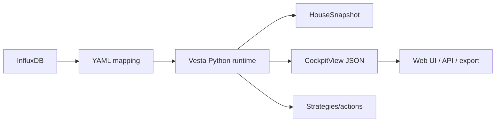

# Vesta Python Runtime

Objectif: faire tourner Vesta hors Home Assistant, par exemple sur un Raspberry Pi ou une carte industrielle qui a acces a InfluxDB.

## Architecture



Le navigateur ne lit jamais InfluxDB directement. Le token InfluxDB reste cote serveur via `VESTA_INFLUX_TOKEN`.
Pour l'interface portable, le contrat vise MQTT pour les mesures live et une API historique pour les series longues. Voir `docs/data-sources.md`.

## Installation minimale

```bash
python3 -m venv .venv
. .venv/bin/activate
pip install -e ".[standalone]"
```

Sans YAML, le moteur de base reste utilisable avec un snapshot JSON:

```bash
PYTHONPATH=src python3 -m vesta_bioclimatic.cli assess examples/sample_snapshot.json
```

## Fichiers YAML

- `config/site_house.yaml`: habitation, pieces, etages, capteurs, volumes, orientation, ventilateurs.
- `config/site_system.yaml`: systeme technique, modules, entrees/sorties, extracteurs, condenseur, echangeur.
- `config/actuators.yaml`: vocabulaire et conventions des actionneurs.
- `config/influx_mapping.yaml`: conventions InfluxDB recommandees.

Le choix robuste est de partir de l'InfluxDB existante et de declarer manuellement les bonnes series dans le YAML. L'extraction InfluxDB sert d'aide, pas de source de verite automatique.

## Commandes

Installer les templates dans un dossier de configuration:

```bash
vesta-bioclimatic init-config /opt/vesta/config
```

Construire une vue cockpit depuis un YAML et des dernieres valeurs:

```bash
vesta-bioclimatic view \
  --site config/site_house.yaml \
  --values examples/latest_values.json
```

Inspecter InfluxDB pour preparer le mapping:

```bash
export VESTA_INFLUX_TOKEN="..."
vesta-bioclimatic inspect-influx --site config/site_house.yaml --window 30d
```

## Maisons vs systemes

Dans une habitation, `groups` represente les etages ou zones:

```yaml
groups:
  rdc: RDC
  floor_1: "1"
```

Dans un systeme technique, `groups` represente les modules:

```yaml
groups:
  exchanger: Echangeur double flux
  condenser: Condenseur
```

L'interface peut utiliser les memes liens de groupe: entre pieces d'un meme etage, ou entre capteurs entree/sortie d'un module.

## Actionneurs

Chaque actionneur separe la commande demandee et le retour reel:

```yaml
actuators:
  living_ceiling_fan:
    kind: ceiling_fan
    space: living
    command_metric: living_ceiling_fan.command
    actual_metric: living_ceiling_fan.actual
```

Le runtime expose ensuite:

- `synchronized`: `true`, `false` ou `null`;
- `status`: `synchronized`, `pending_or_divergent`, `command_only`, `actual_only`, `unobserved`.

Cette separation permet de traiter proprement les cas ou l'utilisateur, une telecommande IR, une app cloud ou le controle automatique agissent en meme temps.

## Etapes suivantes

1. Ajouter un petit serveur HTTP Python qui sert `CockpitView` en JSON.
2. Ajouter un connecteur MQTT live qui met a jour `MeasurementStore`.
3. Ajouter une API historique qui lit InfluxDB et calcule la Tpma 7 jours cote serveur.
4. Rebrancher l'interface web sur cet endpoint, sans dependance Home Assistant.
5. Ajouter une ecriture InfluxDB des evenements de commande et feedback utilisateur.
